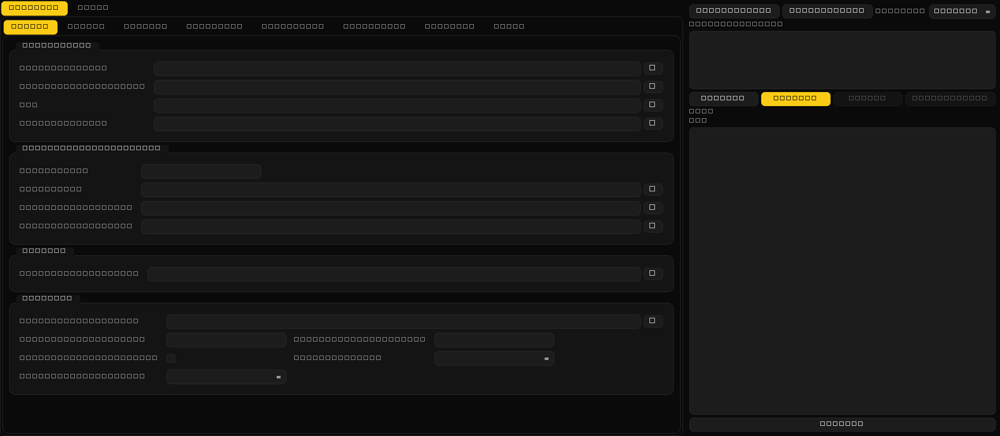

# Anima LoRA — merged trainer

A fast **Anima** LoRA/T-LoRA trainer with a **native desktop control panel**, a **~89-optimizer zoo**, custom LR schedulers, and a **live training dashboard** — three projects merged into one, packaged for one-click Windows install.



<!-- docs/images/native_gui.png is a layout preview rendered headlessly (label text
     may be missing fonts). Replace it with a real screenshot: launch run_gui.bat,
     then capture the window and overwrite this file. -->

> *Native PySide6 control panel (dark "Gemini" theme): Training child-tabs on the left, live command preview + log + Start/Stop on the right.*

---

## What it is

This is a **fork of [anima_lora](https://github.com/sorryhyun/anima_lora)** (the fast `torch.compile` Anima DiT LoRA engine) that merges in two more toolkits and wraps everything in a desktop GUI for distribution:

| From | What it contributes | Vendored as | License |
|---|---|---|---|
| **[anima_lora](https://github.com/sorryhyun/anima_lora)** | the fast base — `torch.compile` LoRA training of the Anima DiT (constant-token bucketing + native-flatten compile, flash-attn, block-swap, fully-cached dataloader) | the repo itself | MIT |
| **[LoRA_Easy_Training_Scripts](https://github.com/67372a/LoRA_Easy_Training_Scripts)** | the broad **optimizer + scheduler** suite (~89 optimizers, CAWR/RAWR schedulers) | `custom_scheduler/LoraEasyCustomOptimizer/` | GPL-3.0 |
| **[AnimaLoraToolkit](https://github.com/Moeblack/AnimaLoraToolkit)** | the live **web monitor** (loss / val-loss / LR / sample dashboard) | `library/monitoring/` | GPL-3.0 |

> The combined, distributed work is **GPL-3.0** — see [License & attribution](#license--attribution). The **model weights** are governed by a separate **non-commercial** license; that section is required reading before you publish anything you train.

---

## What's new vs. upstream `anima_lora`

Everything in upstream is here (the compile speed-core, methods, preprocess pipeline). On top of that this fork adds:

### Optimizers & schedulers — the LoRA_Easy zoo
- **~89 optimizers** via `--optimizer_type <name>` (friendly names: `CAME`, `ADOPT`, `Prodigy`, `ProdigyPlusScheduleFree`, `FMARSCrop`, `SODAWrapper`, …) resolved through the vendored `LoraEasyCustomOptimizer` registry, falling back to the kohya dotted-path loader. Upstream ships only the kohya built-ins.
- **Custom LR schedulers** (CosineAnnealingWarmRestarts / Rex / `warmup_stable_decay` / `cosine_with_min_lr`, …) via `--lr_scheduler_type <dotted path>`, plus a one-shot **constant→cosine** tail. Schedule-free optimizers auto-bypass the scheduler.
- Import is hardened with a torchao/bitsandbytes compat shim so missing optional deps are skipped, never break startup.

### Live training dashboard (web monitor)
- `--monitor` starts a pure-stdlib **Chart.js dashboard** (loss / **val-loss** / LR curves + decoded sample previews) at `http://127.0.0.1:8765` — attaches as a composing progress sink, so it costs ~nothing and can't crash training. Curves rehydrate on `--resume`.
- **Runtime LR control** from the dashboard (×0.5 / ×2 / on-demand cosine decay / reset).
- **Offline replay** (`tasks.py monitor`) to compare saved runs, an **MCP server** (`tools/anima_monitor_mcp.py`) so an AI agent can watch the run, and an **AI watch party** (`tools/ai_watch_party.py`) where Claude + GPT debate training health into the dashboard.

### Native desktop GUI (replaces the old browser GUI)
- A **PySide6 desktop control panel** (`run_gui.bat`) drives `train.py` through a shared torch-free backend — native OS file dialogs, no localhost port, real widgets, English / 한국어 toggle, **Ctrl+F** to find any argument, dependency **greying with reasons**, a key=value editor for `*_args`, and per-arg Korean help.
- *(The earlier Gradio browser panel has been removed — the native panel is the only GUI.)*

### Adapters & training features
- **Full LyCORIS family on the Anima DiT** (LoKr, LoHa, DyLoRA, GLoRA, Diag-OFT, BOFT, Full) **with the `torch.compile` speed-core intact**, via the `networks.lycoris_anima` bridge (`lycoris-lora` dep + Anima-targeted presets).
- **Per-subset held-out validation (`is_val`)** — mark a subset in the GUI and its whole folder is held out for the validation pass (none trains), so the dashboard's val-loss reflects a real held-out set. (Upstream validation is only a dataset-level random split.)
- Plus the methods/inference stacks carried from the base (EasyControl, Soft Tokens, ChimeraHydra, Turbo/DP-DMD distillation, Spectrum / SPD / DCW / SMC-CFG inference).

### Packaging
- One-click Windows launchers (`install_uv.bat` / `install_pip.bat` / `run_gui.bat` / `update.bat`), a `requirements.txt` pip mirror, and a **GPL-3.0** relicense (forced by the two vendored GPL-3.0 toolkits).

---

## Quickstart (Windows)

```powershell
git clone https://github.com/UR-al/training_Anima_lora
cd training_Anima_lora
install_uv.bat                 REM via uv (recommended). install_pip.bat = pip alternative (needs Python 3.13)
run_gui.bat                    REM opens the native desktop control panel
```

Then, in the GUI's **Model paths** (or via `make download-models`), fetch the Anima DiT + Qwen3 text encoder + VAE — they are **not** shipped in this repo. Point the dataset at a folder of images with `.txt` caption sidecars, toggle **Auto-preprocess on Start**, and hit **Start**. `update.bat` later pulls + re-syncs.

---

## The control panel — `run_gui.bat`

`run_gui.bat` (or `python tasks.py native-gui`) opens the **native PySide6** panel. Opt-in `gui` extra: `uv sync --extra gui` (the launchers do this for you).

- **Training tabs** — Folder / Subset / Network / Optimizer / Monitoring / anima_lora / Metadata / Extra. Pick **method / preset / optimizer (~89) / scheduler** from dropdowns; set rank, LR, epochs, seed, and optimizer/scheduler args via key=value blocks. Curated fields plus every `train.py` `--flag` (auto-routed and clustered) are exposed.
- **Subsets** — add subset **cards** (per-subset repeats / keep-tokens / caption dropout / tiers / batch-size / flip / random-crop / grad-checkpointing), each with an **`is_val`** toggle to hold the whole subset out for validation. Or load a `dataset_config` TOML (LoRA_Easy / kohya compatible).
- **Find (Ctrl+F)** — search any argument by name or description and jump straight to it.
- **Guidance** — per-field help, dependency **greying with reasons** (disabled fields show *why*), inline optimizer/scheduler arg help.
- **Run** — preview the exact command, then **Start** / **Stop**. Training runs as a direct `train.py` subprocess; stdout/stderr is captured to `output/logs/` and tailed live. A saved-run **Queue** launches runs sequentially.
- **Utils** — Dataset viewer/editor (mask painting, near-duplicate detection, tag sorting), Preprocess, Update, Auto-batch search, SAM3+MIT masking.
- **Language** — English / 한국어, switchable live (remembers your tab, scroll, and field values).

---

## CLI

```powershell
python tasks.py lora --optimizer_type CAME --monitor                              REM named optimizer + dashboard
python tasks.py lora --method lora --preset low_vram --dataset_config my.toml --network_dim 32
```

`--optimizer_type <name>` takes a friendly name (`CAME`, `ADOPT`, `Prodigy`, …) or any `pkg.module.Class`. `--lr_scheduler_type <dotted path>` selects a custom scheduler. `--monitor` starts the dashboard. `make`/`python tasks.py <target>` are interchangeable; `make help` lists every target and `CLAUDE.md` is the full reference.

### LoKr / LoHa & the full LyCORIS zoo

```powershell
REM LoKr (factor decomposition; no grad-checkpointing needed)
python tasks.py lora --method lycoris --network_args algo=lokr preset=configs/lycoris_presets/anima_attn_mlp.toml factor=4 full_matrix=True

REM LoHa (materializes full ΔW per module — add --gradient_checkpointing + a small rank on <=16 GB)
python tasks.py lora --method lycoris --network_dim 16 --network_alpha 8 --gradient_checkpointing --network_args algo=loha preset=configs/lycoris_presets/anima_attn_mlp.toml
```

In the GUI just set **Network → `networks.lycoris_anima`** and pick an **algo** + **preset** (`anima-attn-mlp` = attention+MLP, 197 modules; `anima-full` = +adaln/embeds, 314).

---

## Monitoring & validation loss

Pass `--monitor` (or set `monitor = true` in a config TOML) to open the dashboard. It plots the **training loss** (raw + EMA), the **learning rate**, and — when validation runs — the **validation loss** as its own series plus a headline **Val loss** readout (latest + best). Sample PNGs decoded during training surface in a scrubber.

To get a validation curve, give the run a held-out set: either mark a subset **`is_val`** in the GUI (its whole folder validates), or set a dataset-level `validation_split_num`. CMMD (PE-Core MMD²) is the default validation signal; `--no-use_cmmd` falls back to the per-σ FM-MSE val pass.

---

## Requirements

| | Minimum | Recommended |
|---|---|---|
| GPU | RTX 3060 (8 GB) | 16 GB+ |
| System RAM | 16 GB | 32 GB+ |
| Disk | 60 GB | 200 GB+ |

Python 3.13 + PyTorch 2.12 (cu132) are installed for you. `torch.compile` needs the CUDA 13.2 toolkit (nvcc).

For a manual / CI pip install, `requirements.txt` mirrors the dependencies (cu132 torch index + `--pre` baked in): `pip install -r requirements.txt && pip install -e . --no-deps`. (`pyproject.toml` + `uv.lock` remain the uv source of truth.) Fetch the model weights (Anima DiT + Qwen3 text encoder + VAE) into `models/` — they are **not** shipped here (gitignored) — or point the GUI's **Model paths** at existing forge-neo / ComfyUI files.

---

## License & attribution

This repository bundles code from several projects, so **two independent license layers apply** — the **code** and the **model weights**. Read both.

### Code — GPL-3.0

The combined work distributed in this repository is licensed under **GPL-3.0** (see [`LICENSE`](LICENSE)). The copyleft is load-bearing: the repo **vendors GPL-3.0 code**, so the distribution as a whole must be GPL-3.0.

| Component | Upstream license | Lives in | Note |
|---|---|---|---|
| **anima_lora** base engine | **MIT** | the repo itself | the original toolkit code (© 2026 Seunghyun Ji); MIT text kept as [`LICENSE-MIT`](LICENSE-MIT) |
| **kohya-ss/sd-scripts** derivation | **Apache-2.0** | `library/`, `networks/` | this repo was originally adapted from sd-scripts; those portions stay Apache-2.0 ([`LICENSE-APACHE`](LICENSE-APACHE)); modifications stated in [`NOTICE`](NOTICE) |
| **LoRA_Easy_Training_Scripts** optimizer/scheduler zoo | **GPL-3.0** | `custom_scheduler/LoraEasyCustomOptimizer/` | vendored; individual optimizer files keep their original author headers (Apache-2.0 / MIT / BSD-3-Clause) |
| **AnimaLoraToolkit** web monitor | **GPL-3.0** | `library/monitoring/` | derives from ComfyUI (GPL-3.0) |

The two GPL-3.0 components (the optimizer zoo and the monitor) are why the combined work is GPL-3.0. Under GPL-3.0 you may use, modify, and redistribute the code — including commercially — provided you keep derivatives under GPL-3.0 and offer source for what you distribute. The permissive MIT/Apache portions retain their original licenses where separable.

### Model weights — separate, **non-commercial**

The Anima base weights are **not** covered by the code license. They are published by CircleStone Labs LLC under the **CircleStone Labs Non-Commercial License v1.0 (NCL)**:

- The Anima / CircleStone base weights stay under the NCL — obtain them from their original source and comply with it.
- **LoRA adapters, fine-tunes, and merges trained from the Anima weights are "Derivatives" under the NCL and inherit its non-commercial terms** — regardless of the GPL-3.0 on this code.
- Train on a *different* base model you hold commercial rights to, and the NCL does not attach; only the code license applies to those adapters.

The full NCL text ships with the weights (not redistributed here, to avoid staleness). See <https://huggingface.co/CircleStoneLab> or the model card where you obtained the weights. Full detail in [`NOTICE`](NOTICE).
